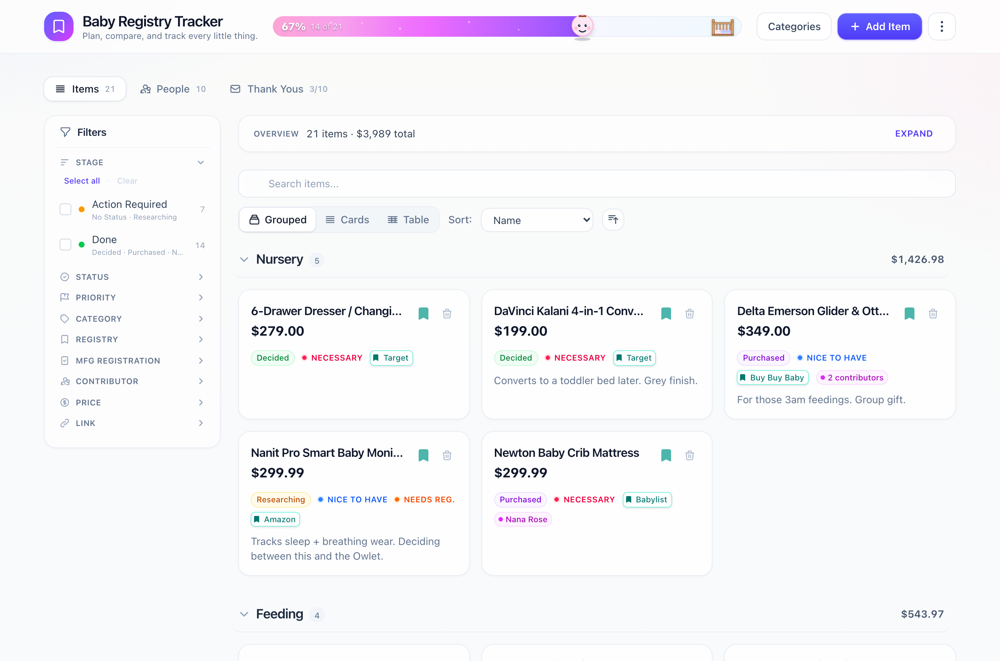
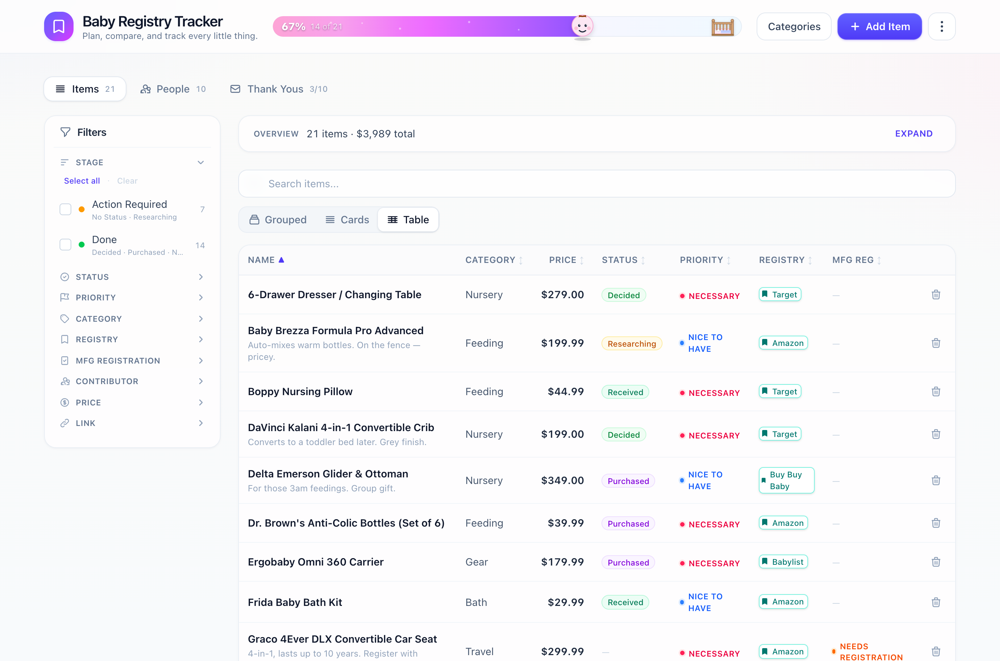
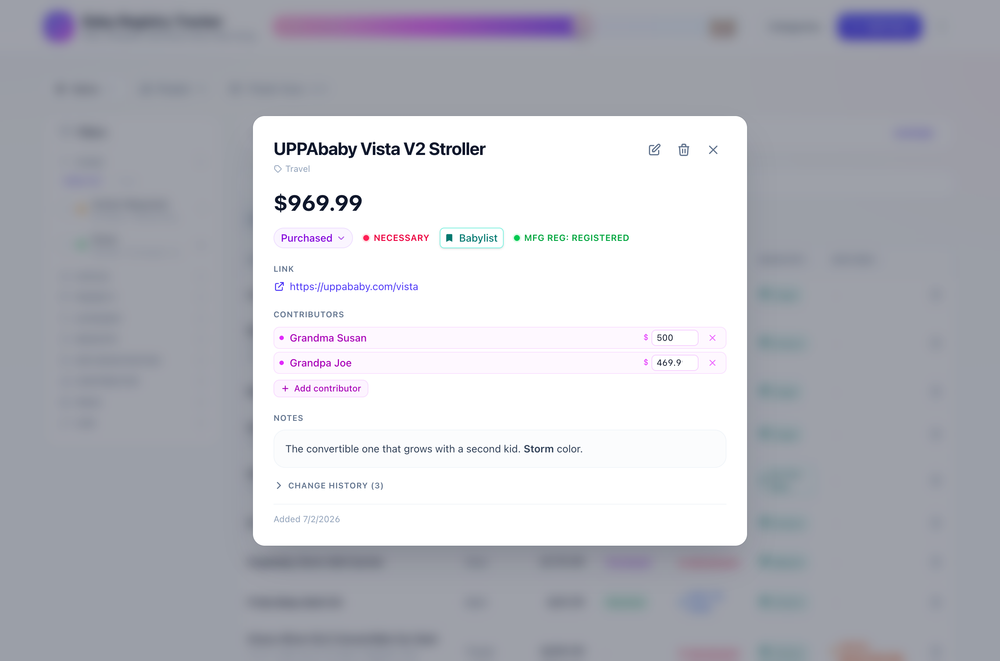
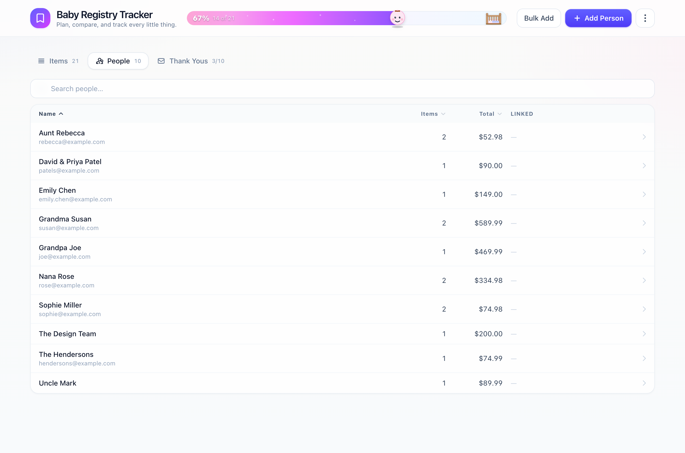
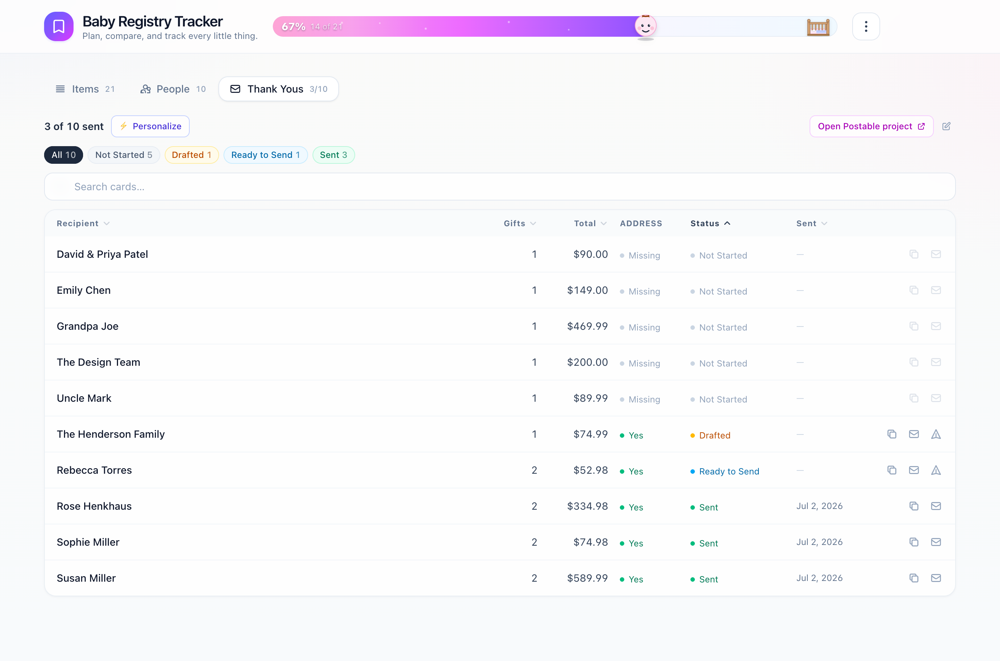
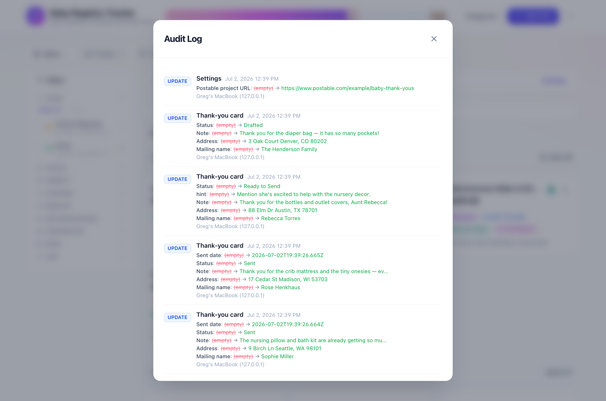

# Baby Registry Tracker

A self-hosted web app for planning and organizing a baby registry across multiple
stores. Track items, prices, priorities, and purchase status in one place — with
markdown notes, automatic product-link scraping, a full audit log, and an MCP
server so you can manage the registry from Claude.

> **Heads up — no authentication.** The app has no login; anyone who can reach
> the port can read and edit everything. It's designed to run on a trusted LAN
> (optionally behind TLS via the included nginx config). Do **not** expose it
> directly to the public internet.

## Screenshots

Plan and compare items across every registry, track who's giving what, and keep
thank-you cards moving — all from one place.



| Table view — sortable columns for every field | Item detail — status, contributors, notes & change history |
| :---: | :---: |
|  |  |
| **People** — who gave what, and how much | **Thank-yous** — draft, address, and track every card |
|  |  |

Every create, update, and delete is recorded in the audit log — with who changed
what, and when:



## Features

- **Item tracking** — name, category, price, priority, status, registry, product
  link, and manufacturer-registration status (for strollers, car seats, etc.)
- **Filtering & views** — filter by status / priority / category / registry,
  full-text search, and grouped / card / table views with sortable columns
- **Spending summary** — a chart of spend by status and category
- **Markdown notes** on every item
- **Automatic link scraping** — paste a product URL to pull in its image + title
- **Audit log** — every create / update / delete is recorded with actor and time
- **MCP server** — expose the registry to Claude as tools and resources

## Tech stack

- **Frontend:** React 19 + TypeScript, Vite 8, Tailwind CSS v4
- **Backend:** Express 5, better-sqlite3 (SQLite)
- **Extras:** `marked` + `dompurify` (markdown), `cheerio` (link scraping)
- **MCP:** `@modelcontextprotocol/sdk`

## Quick start

Prerequisites: **Node.js 20+** and [Task](https://taskfile.dev)
(`brew install go-task`, or see the install docs).

```bash
# 1. Install dependencies (Tailwind v4 + Vite 8 require legacy peer deps)
task install

# 2. (optional) configure environment
cp .env.example .env   # then edit as needed

# 3. Run the API + frontend together
task up
```

Then open http://localhost:5173. The Vite dev server proxies `/api` to the
Express backend on port 3001.

Prefer raw npm? `npm install --legacy-peer-deps`, then run `npm run server` and
`npm run dev` in two terminals.

## Configuration

Copy `.env.example` to `.env`. All keys are optional for local development:

| Variable | Used by | Purpose |
|----------|---------|---------|
| `JSONLINK_API_KEY` | app | Enables product-link scraping via jsonlink.io |
| `PORT` | app | Express server port (default `3001`) |
| `PI_HOST`, `PI_USER` | deploy.sh / setup-certs.sh | SSH target host + user |
| `DOMAIN`, `CERTBOT_EMAIL` | setup-certs.sh | Public domain + Let's Encrypt contact |
| `AWS_ACCESS_KEY_ID`, `AWS_SECRET_ACCESS_KEY` | setup-certs.sh | Route53 DNS-01 challenge |

## Tasks

Run `task` to list everything. Common ones:

| Command | Description |
|---------|-------------|
| `task up` | Run API + frontend together |
| `task build` | Type-check and build the frontend to `dist/` |
| `task start` | Build, then serve API + built frontend from one process |
| `task seed -- file.json` | Seed the database from a JSON export |
| `task lint` | Run ESLint |
| `task deploy` | Build and deploy to your host (see below) |

## Production & self-hosting

The Express server serves both the API and the built frontend, so a single
process runs everything:

```bash
task build
npm run server   # serves on $PORT (default 3001)
```

The repo also includes tooling for a self-hosted deployment behind nginx + TLS
(originally a Raspberry Pi on a home LAN):

- `deploy.sh` — builds, packages, SCPs to `$PI_HOST`, preserves the database, and
  restarts the app under systemd
- `nginx/baby-registry.conf.template` — reverse proxy for 80/443 → :3001. Run
  `task nginx:config` to render it from `.env` (`DOMAIN`) into a gitignored
  `nginx/baby-registry.conf`, then install that on the host
- `setup-certs.sh` — issues a Let's Encrypt cert via the Route53 DNS-01
  challenge, so the host never needs to be internet-reachable

Set `PI_HOST`, `PI_USER`, `DOMAIN`, and `CERTBOT_EMAIL` in `.env`, then:

```bash
task deploy          # or: bash deploy.sh <host> <user>
```

See [CLAUDE.md](CLAUDE.md) for the full deployment and TLS walkthrough.

## Data & the database

Data lives in a SQLite file (`registry.db`) at the project root, created
automatically on first run. It is **gitignored** — it holds personal data and is
never committed. Schema migrations run automatically on server startup. Import
and export JSON from the app's UI, or seed from a file with `task seed`.

## MCP server

The `mcp-server/` package exposes the registry to Claude as tools (list / create /
update items, categories, scraping, audit log, summary stats) and resources.
`.mcp.json` registers it and points at the API via `REGISTRY_API_URL` (default
`http://localhost:3001`). See [CLAUDE.md](CLAUDE.md#mcp-server) for details.

## Contributing

See [CONTRIBUTING.md](CONTRIBUTING.md).

## License

[MIT](LICENSE) © 2026 Gregory Henkhaus
